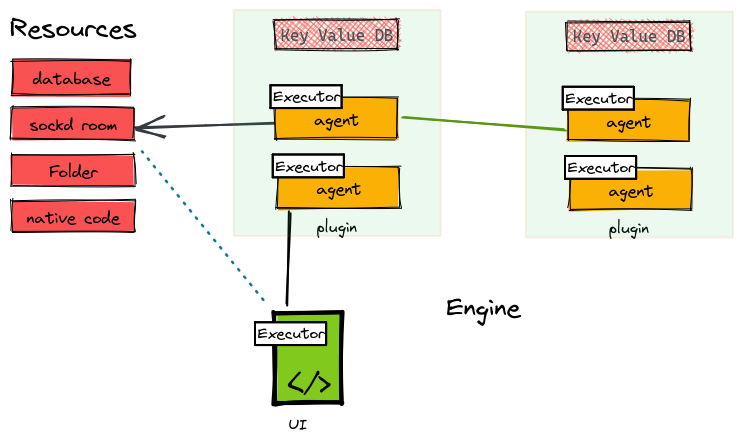

# Docs

Temphia is a platform/runtime for web apps, also known as "plugs", which run inside a language virtual machine (VM) such as JavaScript (JS) or WebAssembly (Wasm), and communicate with each other through message passing. Apps are granted different capabilities based on the resources assigned to them. For example, if an app needs to save files, it would be assigned a resource of type "folder", which grants it the capability to perform file-saving actions using the assigned resource handle. Similarly, other types of resources such as websocket rooms, data tables, and groups of users provide different capabilities to apps based on their requirements. Custom resource types can also be added, as the runtime is designed to be easily extendable. This approach allows apps to have specific capabilities based on the resources they are assigned. Each app also has its own private key-value storage for storing simple states, and can optionally assign a data table resource for more complex database needs.

Additionally, app has an associated user interface (UI) written in JS, which is executed inside an iframe or sub-origin (e.g., xyzapp.mytemphia.com). The higher-level idea behind the runtime is similar to how game engines are typically developed, where most of the logic is written in a high-performance language like C/C++, with a more flexible scriptable language like Lua on top of it but designed for running lightweight web apps.

## Database

Database layer is sits on top of [upperdb](https://github.com/upper/db).

| Vendor       | Support   | Notes                                         
|--------------|-----------|-----------------------------------------------
| Postgres     | ✔️         |  using upper.                                 
| SQLite       | ✔️         |  using upper.                                 
| MySQL        | ❌         |  suppored by upper, should be "trival" to add.
| MSSQL        | ❌         |  suppored by upper, should be "trival" to add.

## Executors

| Vendor       |type    | Notes                                         |
|--------------|--------|-----------------------
| javascript   |`lang`  |  using [goja](https://github.com/dop251/goja)
| webassembly  |`lang`  |  using [wazero](github.com/tetratelabs/wazero)
| pagedash     |`loader`|  dashbaord with js hooks  
| pageform     |`loader`|  form (wizard) with js hooks

- [FAQ](./faq.md)
- [Architecture](./arch.md)
- [Glossary](./glossary.md)